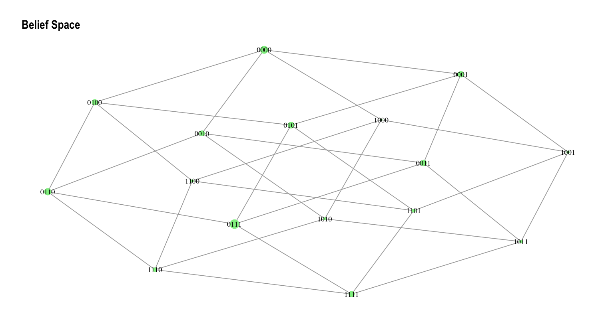

I am interested in cultural change. Specifically, I am interested in the instances that prompt individuals to revisit the habits and beliefs that have served them well in the past. There are many parts to this puzzle: we have to understand what beliefs are and how to measure them; what the relationship between beliefs and behavior is; how cultural beliefs are transmitted; and what kind of social structures allow for the effective transmission and retention of culture. In my work, I try to shed light on these issues. 

## Moral Beliefs 

I am very interested in moral beliefs - ideas about what is right and wrong. I have done [work](https://www.sciencedirect.com/science/article/pii/S0304422X21001418?dgcid=author) about how we can use the tools of cultural sociology to adjudicate between theories about how we attribute immorality. I am currently collaborating with [Daniela Goya-Tochetto](https://www.danielagoyatocchetto.me/about) and [Kurt Gray](https://www.kurtjgray.com/), developing an instrument that can capture how people perceive the vulnerability of different agents. These differences in perceived vulnerability, we argue, account for some of the variance we see in moral judgment across groups. 

## Social Learning 

Part of understanding how people change their beliefs and habits is to ask where they find novel information. During grad school, I became familiar with work on social influence, but it was particularly exciting to see that there is a whole line of interdisciplinary work examining how we learn from one another. I - alongside [Tom Wolff](https://twitter.com/T_mWolff) - use tools from the social learning literature to note that that the learning strategies that agents use combine with network topologies to produce different patterns of cultural diffusion. I am working in building models that are able to detect the prevalence of different learning strategies (e.g. prestige-biased social learning vs. follow-the-majority) in longitudinal relational data. Along with [Alberto Acerbi](https://acerbialberto.com/), I am also working on a project that seeks to explore a tension that exists in the social learning literature: if humans are such keen foragers of social information, why do they often underuse such information?

## Formative Periods 

Recent work on attitudinal change suggests that adults rarely update their beliefs.  After the socialization and exploration that characterizes our formative years, the story of adulthood is one of stability. This finding resonates with interdisciplinary work, which has evidenced these periods of increased malleability across species and contexts. Questions remain, however, about what it is about these periods that leads to attitudinal formation and change. Biological rhythms are part of the explanation, but these formative periods are also quite particular: they are characterized by sustained social learning and punctuated by changes in social contexts. I have tried to explore these questions. In this [paper](https://osf.io/preprints/socarxiv/y8b2e), I try to explore the interaction between the shape of formative periods and the demographic characteristics of a group. I argue that these two factors might combine to produce different patterns of cultural change. In other words, if individuals change with higher chance during a particular life-stage, then large-scale change should - at least partially - be a result of how many agents open to change there are at any point. The size of formative periods, along with the age-structure of a group, define this supply of "changers". 

Now, whether the shape of formative periods actually varies across historical and cultural contexts is an empirical question. In a ongoing project with [Kevin Kiley](https://krkiley.github.io/), we try to answer this question by looking at longitudinal data for individuals of the same age bands but from different cohorts. Specifically, we are interested in testing the hypothesis of whether young adulthood has extended.  

Along with [Steve Vaisey]("https://vaiseys.github.io"), we are using the World Values Survey to examine the mechanisms of social change across different countries throughout the last four decades. We notice that the cohort-replacement model of change is particularly explanatory when it comes to "sensitive" issues. In other words, issues that are more difficult to talk about change more privately. 

## Attitudinal Formation and Change 

An important question is how we are socialized into our beliefs. Who is likely to keep the same moral beliefs as their parents? Who is likely to change? Along with [Turgut Keskinturk](https://tkeskinturk.github.io/), we are trying to shed light on these questions. Drawing inspiration from [Kevin Kiley's](https://krkiley.github.io/) work, we conceive of belief spaces as a set of more or less adjacent positions, where individuals can place themselves. These spaces can be thought of as rugged landscapes: certain positions are more stable than others, representing the global optima. We are interested in trajectories of movement across that rugged landscape - who stays around the peak where they start? Who makes what are known as "hot transitions", traveling between different optima? To answer these questions we are using longitudinal data and computational text analysis. 

## Networks for Cultural Transmission 

Social scientists have often envisioned cultural transmission occurring through social networks. In my work, I explore the role of networks in the transmission or retention of cultural information. With different colleagues, we recently published a simulation-based [paper](https://royalsocietypublishing.org/doi/full/10.1098/rsos.211324) that shows that central-place foraging results in networks that are well suited for cultural transmission. I am also currently collaborating with a team of sociologists and ecologists looking at how resilient the networks of multiple species are to different types of node removal. 

## Functionalism in Sociological Explanations

Along with [Andrés Castro Araújo](https://acastroaraujo.github.io/) we have noticed a trend: even though functionalism has been a derogatory term in sociology, a lot of sociological explanations still use functionalist arguments cryptically. We argue that this disconnection stems from associating functionalist explanations to substantive theories of the social world. This need not be the case. We contend that functionalism encompasses several styles of argument that can be more or less appropriate given the claims advanced, and that require more or less empirical evidence to be adjudicated. 